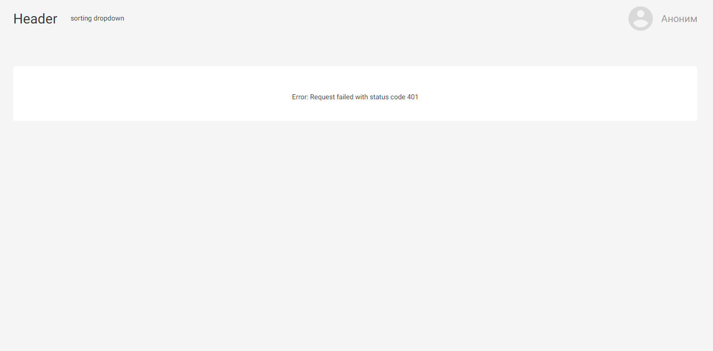
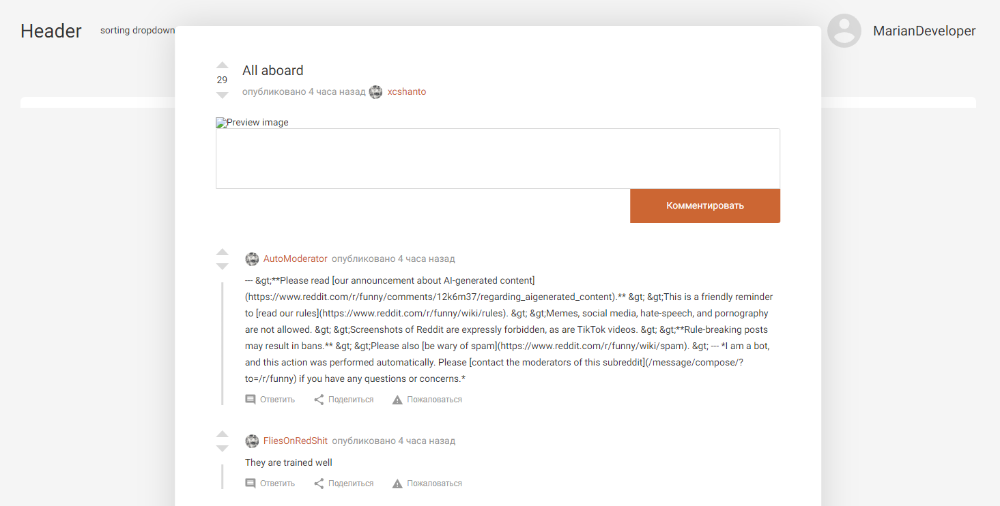

# React reddit app
A simple reddit mirror app that is built on React.js. It uses TypeScript for safety, 
Redux for state management, react-router-dom library for routing.

P.S. The app isn't actually done up to the end and of course it needs to be improved. Nevertheless the main features of an app are realized






## Usage
- Click on the top right button to authorize and get access to the posts
- After authorization you can see the posts that are getting popularity in reddit. To view more posts just scroll down
- To get the detailed information about the post click on a title of the post and now you can also see the comments beneath. To get back just click on any place outside of the modal

## Setup
```
$ npm install
$ npm run dev
```

## Author
Marian Roshchupkin &lt;roshchupkin.marian@gmail.com&gt;

Updated on: 29 April 2023

## License
MIT - see [LICENSE](LICENSE)